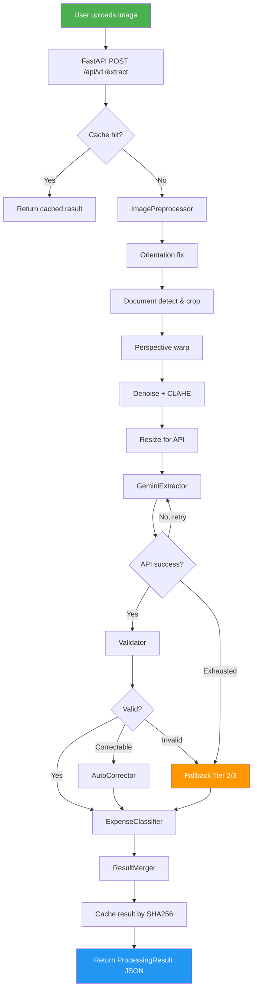

# SmartReceipt VN — Project Proposal

> **Author:** Lam Hoang Phuc  
> **Date:** 2026-04-08  
> **Version:** 1.0  
> **Status:** Active Development

---

## 1. Problem Statement

Vietnamese consumers and small businesses accumulate receipts from groceries, restaurants, fuel, and utility payments with no easy way to digitise or categorise them. Manual data entry is slow, error-prone, and never actually happens. Existing OCR tools handle printed English well but fail on Vietnamese text, mixed fonts, low-quality photos, handwritten bills, and the quirky layout conventions of local POS systems.

**The goal:** given a photo of any Vietnamese receipt, automatically return structured data and an expense category — reliably, cheaply, and fast enough to feel instant.

---

## 2. Scope

### In scope
- Receipt types: POS terminal slips, VAT invoices (hoá đơn điện tử), supermarket receipts, handwritten bills from small vendors
- Extracted fields: merchant name, date/time, line items (name, quantity, unit price, subtotal), VAT, total amount, payment method
- Expense categories: 10 fixed categories (see §5)
- Supported languages: Vietnamese (primary), mixed Vietnamese/English
- Input: single JPEG/PNG image (phone photo quality acceptable)
- Output: JSON via REST API + interactive Streamlit UI

### Out of scope
- Multi-page PDF invoices (future work)
- Real-time video / camera stream
- Accounting system integration
- Receipt generation or forgery detection

---

## 3. Approach — Why Hybrid

Three approaches were considered:

| Approach | Accuracy | Cost/receipt | Latency | Control |
|---|---|---|---|---|
| Fine-tune Donut end-to-end | High | Low (inference) | Low | Low — black box |
| Single LLM for everything | High | **High** (~$0.01+) | Medium | Medium |
| **Hybrid VLM + PhoBERT** | High | **Low** (~$0.002) | Low | **High** |

**Decision: Hybrid.**

- Gemini Vision handles the hard part (reading image pixels, understanding 2-D layout, Vietnamese diacritics). No training required.
- PhoBERT handles expense classification — a pure text problem. Fine-tuning costs ~$0 on Colab, inference is 100× cheaper than LLM, and per-class accuracy is fully measurable and controllable.
- Separating vision from classification makes each component independently testable, improvable, and replaceable.

Donut was considered but rejected: fine-tuning requires a large labelled dataset we don't have, and VLM already achieves comparable accuracy with zero training.

---

## 4. System Architecture

### 4.1 High-level flow

```
┌─────────────────────────────────────────────────────────────────┐
│                        User Interface                           │
│              Streamlit  ──────────────  FastAPI                 │
└────────────────────────────┬────────────────────────────────────┘
                             │ image upload
                             ▼
┌─────────────────────────────────────────────────────────────────┐
│                     Receipt Pipeline                            │
│                                                                 │
│  ┌─────────────┐    ┌─────────────┐    ┌─────────────────────┐ │
│  │Preprocessor │───▶│VLM Extractor│───▶│    Validator        │ │
│  │             │    │             │    │                     │ │
│  │• orientation│    │• Gemini API │    │• math check         │ │
│  │• deskew     │    │• structured │    │• date sanity        │ │
│  │• crop       │    │  output     │    │• merchant fuzzy     │ │
│  │• enhance    │    │• retry logic│    │• auto-correction    │ │
│  └─────────────┘    └─────────────┘    └──────────┬──────────┘ │
│                                                   │            │
│                                        ┌──────────▼──────────┐ │
│                                        │ PhoBERT Classifier  │ │
│                                        │                     │ │
│                                        │• vinai/phobert-base │ │
│                                        │• 10 categories      │ │
│                                        │• confidence score   │ │
│                                        └──────────┬──────────┘ │
│                                                   │            │
│                                        ┌──────────▼──────────┐ │
│                                        │  Result Merger      │ │
│                                        │                     │ │
│                                        │• combine fields     │ │
│                                        │• add metadata       │ │
│                                        │• version tracking   │ │
│                                        └─────────────────────┘ │
└─────────────────────────────────────────────────────────────────┘
                             │ ProcessingResult (JSON)
                             ▼
                    ┌─────────────────┐
                    │  SQLite / Cache │
                    │  (SHA256 hash)  │
                    └─────────────────┘
```

### 4.2 Fallback tiers

When a tier fails, the system degrades gracefully rather than crashing:

```
Tier 1 ──▶ Gemini Vision (primary prompt)
  │ fail
  ▼
Tier 2 ──▶ Gemini Vision (alternative/corrective prompt)
  │ fail
  ▼
Tier 3 ──▶ PaddleOCR + rule-based extraction
  │ fail
  ▼
Tier 4 ──▶ Return partial result, flag "needs_human_review: true"
```

Every tier transition is logged with the reason so failures can be analysed.

### 4.3 Component diagram (Mermaid)



### 4.4 Data flow diagram

```
Image (JPEG/PNG)
     │
     ▼  src/preprocessing/pipeline.py
Cleaned Image (numpy array)
     │
     ▼  src/extraction/gemini_extractor.py
Raw Receipt JSON (may contain errors)
     │
     ▼  src/validation/validators.py + correctors.py
Validated Receipt (Pydantic model)
     │
     ├─ merchant_name + item_names
     ▼  src/classification/phobert_classifier.py
(category, confidence)
     │
     ▼  src/pipeline/receipt_pipeline.py
ProcessingResult {
  receipt: Receipt,
  category: str,
  confidence: float,
  fallback_tier: int,
  processing_ms: int,
  model_versions: dict,
  corrections: list[Correction]
}
```

---

## 5. Output Schema

```json
{
  "success": true,
  "receipt": {
    "merchant_name": "Highlands Coffee",
    "date": "2026-03-15",
    "time": "14:32",
    "items": [
      {
        "name": "Americano Size M",
        "quantity": 1,
        "unit_price": 55000,
        "total": 55000
      }
    ],
    "subtotal": 55000,
    "vat": 5500,
    "total_amount": 60500,
    "payment_method": "Thẻ"
  },
  "category": "Ăn uống",
  "confidence": 0.97,
  "metadata": {
    "fallback_tier": 1,
    "processing_ms": 2340,
    "model_versions": {
      "extractor": "gemini-2.0-flash",
      "classifier": "phobert-expense-v1.0"
    },
    "corrections": [],
    "cache_hit": false,
    "estimated_cost_usd": 0.0018
  }
}
```

---

## 6. Expense Categories

### 6.1 Bảng tổng quan

| # | Tiếng Việt | English | Từ khoá nhận dạng nhanh |
|---|---|---|---|
| 1 | Ăn uống | Food & Drink | nhà hàng, quán ăn, café, trà sữa, siêu thị (items là thực phẩm) |
| 2 | Đi lại | Transport | xăng, bãi xe, Grab xe, vé xe buýt/xe khách/tàu nội địa ngắn |
| 3 | Mua sắm | Shopping | quần áo, điện tử, mỹ phẩm, siêu thị (items là đồ dùng) |
| 4 | Giải trí | Entertainment | rạp phim, karaoke, bowling, game, theme park |
| 5 | Hoá đơn tiện ích | Utilities | điện, nước, gas, internet, cáp TV, điện thoại trả sau |
| 6 | Sức khoẻ | Health | nhà thuốc, phòng khám, bệnh viện, gym, thực phẩm chức năng |
| 7 | Giáo dục | Education | sách, học phí, khoá học, văn phòng phẩm (dùng cho học tập) |
| 8 | Du lịch | Travel | khách sạn, vé máy bay, tour, tàu/xe đường dài liên tỉnh |
| 9 | Nhà cửa | Home | nội thất, điện máy gia dụng, vật tư sửa chữa, dịch vụ dọn nhà |
| 10 | Khác | Other | không đủ thông tin hoặc không thuộc 9 nhóm trên |

---

### 6.2 Tiêu chí phân loại chi tiết

> **Nguyên tắc cốt lõi:** Phân loại dựa trên **sản phẩm/dịch vụ thực tế** trên hoá đơn, không phải tên cửa hàng. Một siêu thị VinMart có thể cho ra Ăn uống, Mua sắm, hoặc Nhà cửa tuỳ vào items được mua.

---

#### 1. Ăn uống

**Định nghĩa:** Chi tiêu cho thức ăn, đồ uống tiêu thụ trực tiếp — dù ăn tại chỗ, mang về, hay mua nguyên liệu về nấu.

**Bao gồm:**
- Nhà hàng, quán ăn, quán phở/bún/cơm, quán nhậu, quán bình dân
- Cà phê, trà sữa, nước ép, sinh tố
- Đặt đồ ăn qua app (GrabFood, ShopeeFood, BeFood)
- Siêu thị / minimart / chợ khi phần lớn items là thực phẩm, đồ uống (rau củ, thịt cá, sữa, bánh kẹo, gia vị, đồ uống)
- Bánh mì, tiệm bánh, kem, đồ ăn vặt đường phố

**Không bao gồm:**
- Mua đồ dùng bếp (nồi, chảo) → **Nhà cửa**
- Mua thực phẩm chức năng, vitamin → **Sức khoẻ**
- Đặt xe đi đến nhà hàng → **Đi lại**

**Quy tắc biên giới — Siêu thị/Minimart:**
Nhìn vào danh sách items. Nếu ≥70% giá trị là thực phẩm/đồ uống → **Ăn uống**. Nếu hỗn hợp không rõ ràng → chọn nhóm chiếm tỷ trọng cao nhất theo tổng tiền.

---

#### 2. Đi lại

**Định nghĩa:** Chi tiêu để di chuyển từ điểm A đến điểm B trong phạm vi hàng ngày hoặc nội địa ngắn.

**Bao gồm:**
- Xăng dầu (Petrolimex, Shell, Caltex, PV Oil, v.v.)
- Bãi đỗ xe, phí gửi xe máy/ô tô
- Dịch vụ đặt xe (Grab xe, Be xe, Gojek xe — phân biệt với GrabFood)
- Vé xe buýt, xe khách nội tỉnh/liên tỉnh ngắn, vé tàu điện
- Phí cầu đường, vé qua trạm BOT
- Bảo dưỡng xe định kỳ, vá xe, rửa xe

**Không bao gồm:**
- Vé máy bay, vé tàu/xe liên tỉnh xa phục vụ chuyến đi nghỉ → **Du lịch**
- Mua xe (tài sản lớn) → **Khác**

**Quy tắc biên giới — Grab:**
- Hoá đơn "Grab" có nội dung "GrabCar / GrabBike / GrabExpress" → **Đi lại**
- Hoá đơn "GrabFood / GrabMart" → **Ăn uống** hoặc nhóm tương ứng với hàng mua

---

#### 3. Mua sắm

**Định nghĩa:** Mua hàng hoá phi thực phẩm, phi y tế, phi giáo dục phục vụ nhu cầu cá nhân.

**Bao gồm:**
- Quần áo, giày dép, túi xách, phụ kiện thời trang
- Điện thoại, máy tính, tai nghe, thiết bị điện tử cá nhân
- Mỹ phẩm, sản phẩm làm đẹp, nước hoa, chăm sóc da (không phải thuốc)
- Siêu thị / minimart khi items là đồ dùng cá nhân, vật dụng sinh hoạt (giấy vệ sinh, xà phòng, bột giặt)
- Đồ chơi, quà tặng, đồ lưu niệm

**Không bao gồm:**
- Điện máy gia dụng lớn (tủ lạnh, máy giặt) → **Nhà cửa**
- Sản phẩm chăm sóc sức khoẻ, thuốc → **Sức khoẻ**
- Sách, văn phòng phẩm dùng cho học tập → **Giáo dục**

---

#### 4. Giải trí

**Định nghĩa:** Chi tiêu cho hoạt động vui chơi, giải trí, thư giãn không liên quan đến sức khoẻ hay du lịch.

**Bao gồm:**
- Rạp chiếu phim (CGV, Lotte Cinema, Galaxy)
- Karaoke, billiards, bowling, cà phê board game
- Mua game, nạp tiền game, mua vật phẩm trong game
- Khu vui chơi, công viên giải trí, theme park (nội địa, không phải tour)
- Vé xem thể thao, colosseum, concert

**Không bao gồm:**
- Gym, yoga, bơi lội (mục đích sức khoẻ) → **Sức khoẻ**
- Tour du lịch có bao gồm hoạt động giải trí → **Du lịch** (ưu tiên mục đích chính)

---

#### 5. Hoá đơn tiện ích

**Định nghĩa:** Các hoá đơn dịch vụ thiết yếu thanh toán định kỳ cho hộ gia đình.

**Bao gồm:**
- Tiền điện (EVN và các chi nhánh)
- Tiền nước (công ty cấp thoát nước)
- Gas bình, gas đường ống (PetroVietnam Gas, Saigon Petro)
- Internet, cáp truyền hình (VNPT, Viettel, FPT)
- Hoá đơn điện thoại trả sau, nạp tiền điện thoại
- Phí chung cư, phí quản lý toà nhà

**Không bao gồm:**
- Mua thiết bị điện (bóng đèn, ổ cắm) → **Nhà cửa**
- Mua điện thoại mới → **Mua sắm**

---

#### 6. Sức khoẻ

**Định nghĩa:** Chi tiêu liên quan đến duy trì và cải thiện sức khoẻ thể chất và tinh thần.

**Bao gồm:**
- Nhà thuốc, mua thuốc kê đơn và không kê đơn
- Phòng khám, bệnh viện, nha khoa, mắt kính
- Xét nghiệm, chụp chiếu, siêu âm
- Thực phẩm chức năng, vitamin, thảo dược
- Phòng gym, yoga, bơi lội (mục đích tập luyện sức khoẻ)
- Dụng cụ y tế cá nhân (nhiệt kế, máy đo huyết áp)

**Không bao gồm:**
- Mỹ phẩm làm đẹp thuần tuý (không có công dụng trị liệu) → **Mua sắm**
- Karaoke, bowling để giải trí (dù có lợi sức khoẻ) → **Giải trí**

---

#### 7. Giáo dục

**Định nghĩa:** Chi tiêu liên quan đến học tập, nâng cao kiến thức và kỹ năng.

**Bao gồm:**
- Sách giáo khoa, sách tham khảo, sách nghiệp vụ
- Học phí trường học, trung tâm ngoại ngữ, lớp học thêm
- Khoá học online (Udemy, Coursera, v.v.)
- Văn phòng phẩm khi mua rõ ràng phục vụ học tập (vở, bút, thước)
- Thiết bị học tập (máy tính bảng dùng cho học, đồ dùng học vẽ)

**Không bao gồm:**
- Văn phòng phẩm mua tại cửa hàng chung (không rõ mục đích) → **Mua sắm**
- Máy tính xách tay dùng chung → **Mua sắm**

---

#### 8. Du lịch

**Định nghĩa:** Chi tiêu cho các chuyến đi xa khỏi nơi thường trú, có tính chất tham quan, nghỉ dưỡng hoặc công tác.

**Bao gồm:**
- Vé máy bay nội địa và quốc tế
- Khách sạn, homestay, resort
- Tour du lịch trọn gói
- Vé tàu hoả, xe khách đường dài liên tỉnh xa (mục đích du lịch/công tác)
- Dịch vụ hướng dẫn viên, cho thuê xe du lịch

**Không bao gồm:**
- Grab/taxi đi lại trong thành phố → **Đi lại**
- Ăn uống trong chuyến đi → vẫn là **Ăn uống** (mỗi hoá đơn phân loại độc lập)

**Quy tắc biên giới — Di chuyển liên tỉnh:**
Vé xe khách đi Đà Lạt, Nha Trang, Hà Nội (> 100 km, mục đích du lịch/công tác) → **Du lịch**. Xe buýt nội thành, xe buýt sân bay → **Đi lại**.

---

#### 9. Nhà cửa

**Định nghĩa:** Chi tiêu liên quan đến nơi ở — đồ đạc, thiết bị, sửa chữa, dịch vụ gia đình.

**Bao gồm:**
- Đồ nội thất (bàn, ghế, giường, tủ)
- Điện máy gia dụng lớn (tủ lạnh, máy giặt, điều hoà, lò vi sóng)
- Vật tư xây dựng, sơn nhà, vật liệu sửa chữa
- Dịch vụ vệ sinh nhà, giặt ủi, diệt côn trùng
- Đồ dùng bếp (nồi, chảo, dao, thớt)
- Cây cảnh, phụ kiện trang trí nhà

**Không bao gồm:**
- Điện thoại, máy tính (thiết bị cá nhân) → **Mua sắm**
- Tiền điện, nước, gas → **Hoá đơn tiện ích**

---

#### 10. Khác

**Sử dụng khi:**
- Không đủ thông tin để phân loại (hoá đơn mờ, thiếu tên hàng hoá)
- Hình ảnh không phải hoá đơn (ảnh chụp nhầm)
- Chi tiêu không thuộc 9 nhóm trên (nộp thuế, phí hành chính, từ thiện)
- Hệ thống không chắc chắn và confidence < 0.5

---

### 6.3 Quy tắc ưu tiên khi phân vân

Khi một hoá đơn có thể thuộc nhiều nhóm, áp dụng theo thứ tự:

1. **Nhìn vào items, không nhìn vào tên merchant** — VinMart không phải lúc nào cũng là Mua sắm.
2. **Địa điểm giải trí rõ ràng → luôn là Giải trí**, bất kể tỷ trọng tiền. Nếu merchant thuộc danh sách địa điểm giải trí (karaoke, bi-a/billiards, bowling, rạp chiếu phim, game center, khu vui chơi), toàn bộ hoá đơn — kể cả đồ uống/ăn đi kèm — phân loại là **Giải trí**. Lý do: khách đến vì hoạt động giải trí; đồ uống là phụ trợ, không phải mục đích chính.
   - `BILLIARDS CLUP NEW VIP`: tiền giờ 25k + đồ uống 345k → **Giải trí** (không phải Ăn uống dù đồ uống chiếm 93%)
   - `KARAOKE DORAEMON`: tiền phòng 610k + đồ uống 624k → **Giải trí**
3. **Lấy nhóm chiếm tỷ trọng lớn nhất theo tổng tiền** — áp dụng cho merchant trung tính (siêu thị, minimart, cửa hàng đa năng). Ví dụ: hoá đơn 200k có 150k là thực phẩm và 50k là bột giặt → Ăn uống.
4. **Nếu tỷ trọng ngang nhau (50/50)** → ưu tiên nhóm có độ cụ thể cao hơn (Sức khoẻ > Mua sắm, Giáo dục > Mua sắm).
5. **Mỗi hoá đơn phân loại độc lập** — ăn uống trong chuyến du lịch vẫn là Ăn uống, không phải Du lịch.
6. **Khi vẫn không chắc** → Khác, kèm ghi chú lý do.

---

## 7. Tech Stack

| Layer | Technology | Reason |
|---|---|---|
| Image understanding | Gemini 2.0 Flash | Best vision-language accuracy, generous free tier, structured output support |
| Text classification | PhoBERT (`vinai/phobert-base`) | SOTA Vietnamese NLP, 100× cheaper than LLM at inference, controllable |
| Image preprocessing | OpenCV + Pillow | Industry standard, well-tested, no GPU needed |
| API backend | FastAPI + Pydantic v2 | Async, automatic docs, type-safe schemas |
| Frontend | Streamlit | Fastest path to interactive demo, no JS needed |
| Database | SQLite + SQLAlchemy | Zero-ops, sufficient for portfolio scale |
| Caching | SQLite (image hash → result) | Avoid re-processing identical images, cut API cost |
| Training | PyTorch + HuggingFace Transformers | Standard ecosystem, Colab-compatible |
| Deployment | Docker + Railway (API) + HF Spaces (UI) | Free tiers, CI/CD-friendly |
| Model registry | Hugging Face Hub | Public model hosting, versioning |

---

## 8. Success Metrics

### Accuracy targets (evaluated on golden test set)

| Metric | Baseline (naive prompt) | Target (final) |
|---|---|---|
| End-to-end success rate | ~70% | **≥85%** |
| Field-level accuracy (merchant, date, total) | ~72% | **≥90%** |
| Item F1 score | ~60% | **≥80%** |
| Expense category accuracy | — | **≥88%** |
| Difficulty Group 1 (modern POS) | ~85% | **≥95%** |
| Difficulty Group 2 (VAT invoices) | ~80% | **≥90%** |
| Difficulty Group 3 (supermarket long) | ~60% | **≥80%** |
| Difficulty Group 4 (handwritten) | ~45% | **≥65%** |
| Difficulty Group 5 (poor quality) | ~30% | **≥45%** |

### Performance targets

| Metric | Target |
|---|---|
| p50 latency | < 2 seconds |
| p95 latency | < 5 seconds |
| Cost per receipt | < $0.003 USD |
| Uptime (demo period) | > 99% |

---

## 9. Non-goals (explicit)

- **No real-time processing** — batch is fine for this use case
- **No fine-tuning Gemini or GPT** — cost-prohibitive; prompt engineering is sufficient
- **No multi-user auth** — single-user demo scope
- **No mobile app** — Streamlit web UI is sufficient for portfolio
- **No invoice generation** — extraction only
- **No GDPR/privacy compliance** — demo project, no PII retained beyond session

---

## 10. Known Risks & Mitigations

| Risk | Likelihood | Impact | Mitigation |
|---|---|---|---|
| Gemini API cost overrun | Medium | Medium | Cache by image hash; set daily spend limit |
| Handwritten receipts accuracy too low | High | Low | Document limitation honestly; flag these with low confidence |
| Not enough training data for PhoBERT | Medium | High | Supplement with MC-OCR 2021 dataset; use Gemini for auto-labelling |
| Gemini API downtime | Low | High | Tier 2/3 fallback (alternative prompt, PaddleOCR) |
| PhoBERT accuracy below target | Low | Medium | Try XLM-RoBERTa as alternative; use LLM fallback when confidence < 0.5 |

---

## 11. Timeline Summary

| Week(s) | Phase | Key Deliverable |
|---|---|---|
| 1–3 | Foundation | Golden test set (100 images), baseline evaluation, this document |
| 4–7 | Core Development | Full pipeline with preprocessing, VLM, validation, PhoBERT |
| 8–10 | Optimisation | 85%+ accuracy, FastAPI backend, Streamlit UI |
| 11–12 | Deployment | Public demo, blog post, interview prep |

---

## 12. References

- Nguyen, D. Q., & Nguyen, A. T. (2020). [PhoBERT: Pre-trained language models for Vietnamese](https://arxiv.org/abs/2003.00744)
- Kim, G., et al. (2022). [OCR-free Document Understanding Transformer (Donut)](https://arxiv.org/abs/2111.15664)
- Google. [Gemini API — Structured Output](https://ai.google.dev/gemini-api/docs/structured-output)
- MC-OCR 2021 Dataset — VLSP Shared Task
- VinAI Research. [PhoBERT on Hugging Face](https://huggingface.co/vinai/phobert-base)
